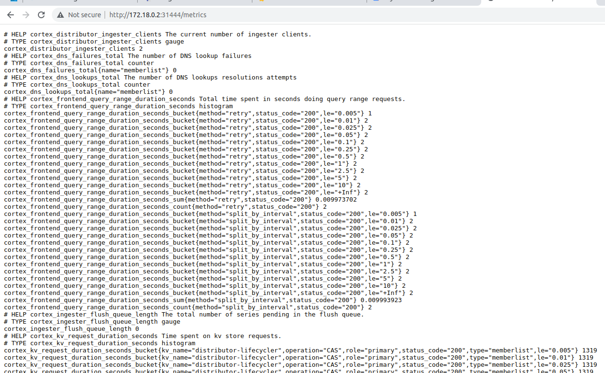

# WIP !!!

## Why Loki?

- Loki project is similar to the ELK/EFK stack, but it's quicker to set up and use. ***Loki only indexes metadata about your logs as a set of labels for each log stream rather than the content of the log***. It reduces the index size, which simplifies processes and, in turn, cuts costs (4*)

- It is a log aggregation system designed to store and query logs (3*)

## Install kube-prometheus

- Check https://github.com/mehmetmgrsl/k8s-prometheus-grafana

## Install Loki

- ```helm repo add grafana https://grafana.github.io/helm-charts```

- ```helm show values grafana/loki-stack > loki-stack-values.yaml```

   - By default in the loki-stack-values:
     - Loki and Promtail are enabled for installation.
     - Prometheus, Grafana, Logstash, fluent-bit, filebeat are disabled. 

- ```helm install -n monitoring --values loki-stack-values.yaml loki grafana/loki-stack```

## Accessing the Loki metrics

- Change the Loki service to use a NodePort with the command below:

   - ```kubectl patch svc loki -n monitoring -p '{"spec": {"type": "NodePort", "ports": [{"name": "http-metrics", "nodePort": 31444, "port": 3100}]}}'```

   - Access the metrics via ```http://<node-ip>:31444/metrics``` , like below:

   - 

## Adding Loki as a Datasource in the Grafana

   - ```kubectl -n monitoring port-forward deployment/prometheus-grafana 3000```

   - Access the dashboard via http://localhost:3000/

   - Add the Loki connection like below:


      - 

      - 


### Resources:
1*. https://grafana.com/docs/loki/latest/?pg=oss-loki&plcmt=quick-links

2*. https://github.com/AdminTurnedDevOps/kubernetes-examples/blob/main/open-source-observability-stack/instructions.md

3* [Mastering Grafana Loki: Complete Guide to Installation, Configuration, and Integration | Part 1](https://www.youtube.com/watch?v=0B-yQdSXFJE)

4* [A Beginner's Guide for Grafana Loki (Open-source Log Aggregation by Prometheus)](https://www.atatus.com/blog/a-beginners-guide-for-grafana-loki/#:~:text=Loki%20project%20is%20similar%20to,%2C%20in%20turn%2C%20cuts%20costs.)

5* https://grafana.com/docs/loki/latest/send-data/promtail/installation/

6* [Mastering Grafana Loki: Kubernetes Log Collection & Integration | Part 2](https://www.youtube.com/watch?v=O52dseg2bJo)


